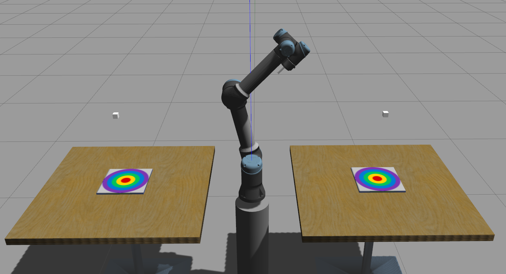
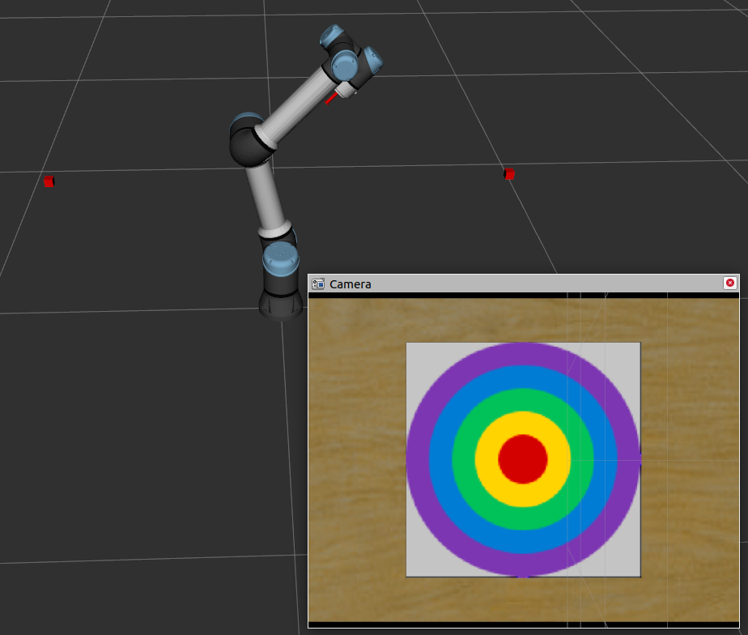

# Variable Admittance Teleoperation
  This project is mainly used variable admittance control for teleoperation. In the variable params setting process, I have used RL to make it more flexible.
**Notice:** MPU6050 will be tested OK but exist some error will be avoided by moving slowly.

